<p align="center">
  
<p>
  
```ll
@str = private unnamed_addr constant [14 x i8] c"Hi, I'm Ubugeeei!\00", align 1

define i32 @main(i32 %argc, i8** %argv) {
entry:
  %puts = tail call i32 @puts(i8* getelementptr inbounds ([14 x i8], [14 x i8]* @str, i64 0, i64 0))
  ret i32 0
}

declare i32 @puts(i8* nocapture readonly) local_unnamed_addr #1
```

<div style="display: flex; justify-align: center;">
<!--   <div> -->
    
<!--   </div> -->
<!--   <div> -->
    
<!--   </div> -->
</div>


```
Born in 2000 in Fukuoka, Japan 🇯🇵
Working as a web engineer in Tokyo 🗼

I work for a startup company as an architect, project leader, team manager, and train members!
On the personal development side, I play around with creating my own browsers and operating systems :)

----------------------------------------------------------------------------

🛠️ Technologies used frequently at work:
    - HTML / CSS / Sass
    - TypeScript
    - Vue / Nuxt (SFC , Composition API, script setup, Pinia, Vuex, Volar)
    - React (Hooks, Recoil, Native,)
    - Jest
    - GarphQL
    - Nest, Prisma, MySQL
    - AWS (Cognito / S3 / Cloud Front / Route53 / Lambda / Amplify / AppSync / Aurora Serverless)
    - Sentry
    - Git / GitLab
    - GitLab CI

🧐 Interest:  
    - Web Frontend
    - UI/UX
    - Infrastructure system (OS, Web Browser, JS Runtime, etc...)  
    - Computer Science 
    - Rust
    - Haskell
    - Lisp 
    - Assembly, LLVM
    - Team Engineering/Management, Frontend Ops
```
